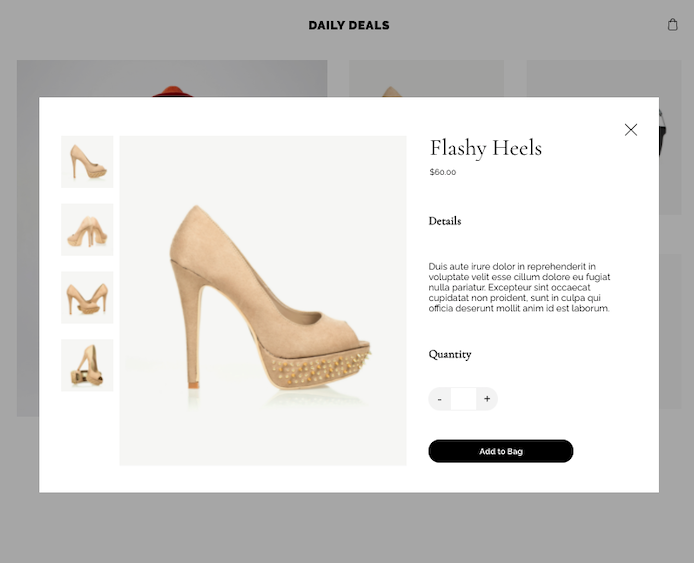
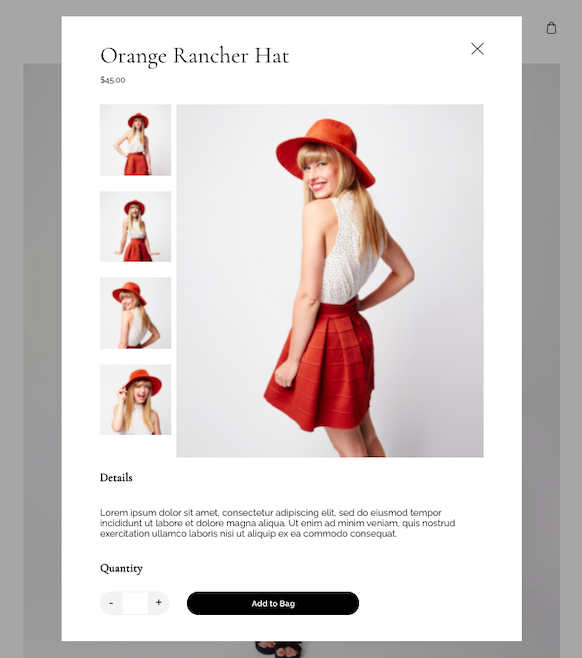
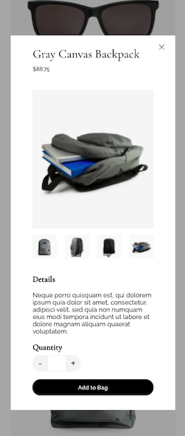

# Code Assessment: Jessica Perez ⭑⭑

## PRODUCT DETAIL PAGE

## SCREENSHOTS

## Table of Contents

1. [Why this assessment](#Why-this-assessment)
2. [Usage](#Usage)
3. [Challenges](#Challenges)
4. [Available Scripts](#Available-Scripts)
5. [Questions](#Questions)

## Why this assessment?

I chose this assessment because I had never done anything like this before. I think this type of functionnality is widely used and good to know how to implement a product detail page.

## Usage

- On the landing page, when a user clicks on the product image or title, the product modal opens with a view of the product's thumbnails, featured image and product details.
- When a user clicks on a thumbnail, the featured image is updated.
- The modal is responsive on different screen sizes.
- When a user clicks on the 'X' to close the modal, it redirects to the landing page.

## Challenges

I was not so familiar with all of the code, but after studying the existing codebase and doing some research, I eventually understood how it all worked.

I did my best to make the modal responsive on all screen sizes, but could not figure out how to perfectly style the product title on large screen.

The css could be "DRY'ed" a little, it seems a little repetitive, but my main goal was to get to the end result and have code that "works".

### Available Scripts

In the project directory, you can run:

#### `yarn`

Install dependencies.

#### `yarn start`

Runs the app in the development mode. 
Open [http://localhost:3000](http://localhost:3000) to view it in the browser.

The page will reload if you make edits. 
You will also see any lint errors in the console.

#### `yarn test`

Launches the test runner in the interactive watch mode. 
See the section about [running tests](https://facebook.github.io/create-react-app/docs/running-tests) for more information.

#### `yarn test:coverage`

Runs tests (out of watch mode) and create a coverage report.

#### `yarn build`

Builds the app for production to the `build` folder. 
It correctly bundles React in production mode and optimizes the build for the best performance. 
The build is minified and the filenames include the hashes.

#### `yarn lint`

Lint all .js files according to ESLint config. Run `yarn lint:fix` to automatically apply fixes.

#### `yarn storybook`

Start a local Storybook server to browse component stories.

## About the Code

This project was bootstrapped with [Create React App](https://github.com/facebook/create-react-app).

#### React

We're using [React](https://reactjs.org/), one of our favorite front-end libraries!

- Our implementation features [React Hooks](https://reactjs.org/docs/hooks-intro.html), a feature that came out in React 16.8. We primarily use the [useState](https://reactjs.org/docs/hooks-state.html) and [useEffect](https://reactjs.org/docs/hooks-effect.html) hooks.
- The app's data is exposed using [React Context](https://reactjs.org/docs/context.html) and managed via a [custom React Hook](https://reactjs.org/docs/hooks-custom.html) called `useAppContext`.
- Routing via [React Router](https://reacttraining.com/react-router/web/guides/quick-start).
- Most of our current React projects validate properties with TypeScript or Flow, but for this exercise we've opted to use Facebook's [PropTypes library](https://github.com/facebook/prop-types). See more info in [the React docs](https://reactjs.org/docs/typechecking-with-proptypes.html).

#### Sass & Fonts

- Fonts are provided by Google Fonts.
- Styling uses CSS modules and Sass. [This article](https://blog.bitsrc.io/how-to-use-sass-and-css-modules-with-create-react-app-83fa8b805e5e) contains a good writeup of how the two work together.

### Questions

For any questions about this app, please refer to my Github page or contact me by email!

- [JessicaPerez1 Github link](https://github.com/JessicaPerez1)
- 1jessicaperez@gmail.com
